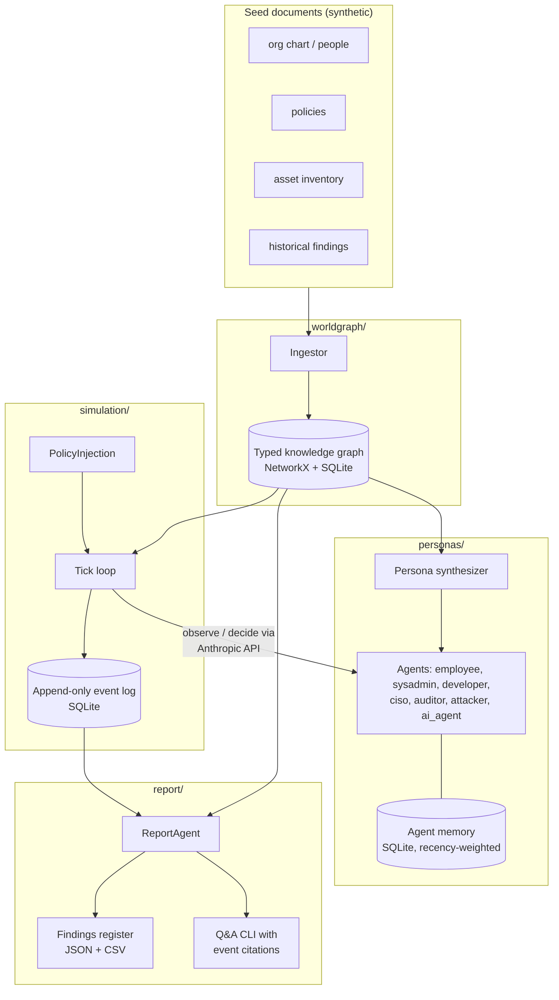

# polistress

    

> Swarm-based GRC policy simulation engine: persona agents stress-test policy changes across a synthetic organization.

polistress ingests documents describing an organization (policies, org chart,
asset inventory, historical findings) into a typed knowledge graph, synthesizes
persona agents from that graph, injects a policy change, and lets the agents
interact over discrete simulation ticks. A report agent then reads the full
event log and emits structured findings — with severity, framework mappings
(NIST CSF, ISO 27001, NIST AI RMF), event citations, and remediation plans —
plus an interactive Q&A interface over the run.

> **Disclaimer:** all seed data shipped with and generated by this repository
> is **synthetic**. The organization, people, assets, findings, and policies
> produced by `scripts/generate_org.py` are fabricated for simulation purposes
> and do not describe any real organization or person.

---

## Architecture



## Quick start

```bash
# 1. Clone and install (Python 3.11+)
git clone https://github.com/arananet/polistress.git
cd polistress
pip install -e ".[dev]"        # or: uv sync

# 2. Generate the synthetic organization (deterministic, --seed)
python scripts/generate_org.py --seed 42

# 3. Ingest it into the knowledge graph
polistress ingest data/synthetic_org

# 4. Run the "AI Usage Policy rollout" scenario (requires ANTHROPIC_API_KEY)
export ANTHROPIC_API_KEY=sk-ant-...
polistress simulate --scenario scenarios/ai_usage_policy.yaml --ticks 30

# 5. Generate the findings register and ask questions
polistress report --run <run_id>
polistress ask --run <run_id> "where did shadow AI emerge?"
```

## Usage

```console
$ polistress ask --run 20260704-a1b2 "where did shadow AI emerge?"
Shadow AI first emerged in the Growth Engineering team at tick 4, when
developer agents adopted an unapproved code assistant to cope with deadline
pressure [evt-00213, evt-00219]. It spread to Data Platform by tick 9 via a
shared workflow [evt-00412] ...
```

Findings are exported as JSON and CSV (`runs/<run_id>/findings.csv`) for
import into GRC tooling. An example findings register from a real end-to-end
run on the synthetic org lives in [`examples/`](examples/).

## Contributing

This project uses **OpenSpec** for spec-driven development — every feature
or bugfix starts with a spec file under `.openspec/specs/`. Each spec
includes a `roles` block to assign responsibility (`implementer`,
`reviewer`, `qa`, `product_owner`). See
[`docs/OPENSPEC.md`](docs/OPENSPEC.md) for the full workflow, or
[`CONTRIBUTING.md`](CONTRIBUTING.md) for the contributor checklist.

## Documentation

| Topic | Where |
|---|---|
| Spec-driven workflow | [`docs/OPENSPEC.md`](docs/OPENSPEC.md) |
| Branch protection setup | [`docs/BRANCH_PROTECTION.md`](docs/BRANCH_PROTECTION.md) |
| Architecture decisions | [`docs/adr/`](docs/adr/) |
| Security policy | [`SECURITY.md`](SECURITY.md) |
| Support channels | [`SUPPORT.md`](SUPPORT.md) |
| Release history | [`CHANGELOG.md`](CHANGELOG.md) |

## License

[Apache-2.0](LICENSE)

---

[](https://ko-fi.com/H2H51MPWG)
