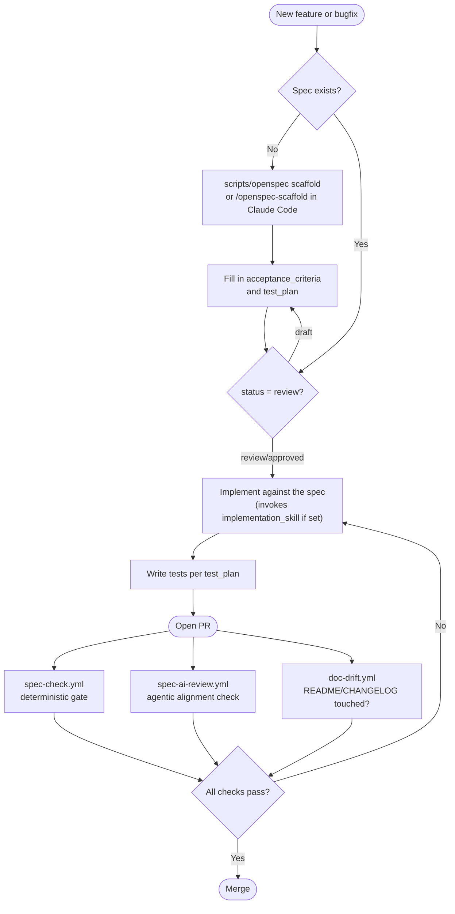
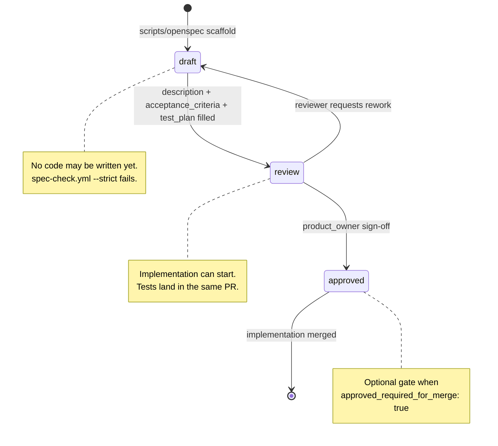
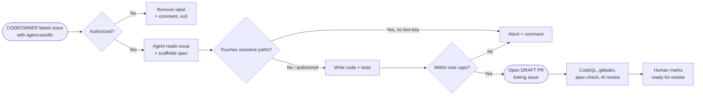

# OpenSpec — Spec-Driven Development for `{{PROJECT_NAME}}`

OpenSpec is the spec-driven workflow this repo enforces. Every feature
or bugfix starts with a spec file in `.openspec/specs/`. The spec
defines acceptance criteria, a test plan, and the domain skill (if any)
to use during implementation. **No spec, no code.**

This doc covers everything OpenSpec-specific. The top-level
[`README.md`](../README.md) intentionally stays focused on the project
itself.

---

## How it works



---

## Spec lifecycle

Every spec moves through three statuses. Each transition has a gate that
prevents downstream work from starting too early.



---

## Layers of enforcement

| Layer | When | What |
|---|---|---|
| Git hook (local) | `git commit` | Blocks commits with source changes but no spec |
| Pre-commit framework (optional) | `git commit` | Runs gitleaks, yamllint, markdownlint, shellcheck |
| CI — lint | Every PR | actionlint, yamllint, shellcheck, markdownlint |
| CI — spec coverage | Every PR | Validates spec fields, status, test_plan |
| CI — tests | Every PR | Runs `testing.test_command` from `.openspec/config.yaml` |
| CI — agentic spec review | Every PR | AI checks if the implementation satisfies the spec |
| CI — doc drift | Every PR | Source change must touch README/CHANGELOG/docs |
| CI — DCO | Every PR | Every commit needs `Signed-off-by:` |
| CI — security | Every PR | CodeQL SAST, gitleaks, dependency review |
| CI — supply chain | Every release | CycloneDX SBOM, cosign signing, SLSA provenance |
| CI — scorecard | Weekly | OSSF Scorecard supply-chain analysis |

---

## Working on a feature

```bash
# 1. Scaffold a spec
scripts/openspec scaffold "user authentication"

# Or for a bugfix:
scripts/openspec scaffold "fix login crash" --type bugfix

# 2. Edit .openspec/specs/<slug>.spec.yaml
#    - Fill description, acceptance_criteria, test_plan
#    - Set status: review

# 3. Implement against the spec
#    Each line of code should trace back to an acceptance criterion.

# 4. Validate before pushing
scripts/openspec check           # all specs
scripts/openspec check --strict  # treat draft as failure
scripts/openspec check --pr 42   # PR coverage check (CI mode)
```

In Claude Code, use the slash commands instead:

| Slash command | What it does |
|---|---|
| `/openspec-scaffold <name>` | Guided spec creation — interactive Q&A, validates required fields |
| `/openspec-implement <slug>` | Reads spec, checks status, invokes domain skill, implements + writes tests |
| `/openspec-check` | Validates spec coverage for current staged changes |

---

## Spec file format

```yaml
title: "Short human-readable title"
slug: "kebab-case-slug"
type: feature           # or bugfix
status: review          # draft | review | approved

description: |
  One paragraph: WHAT this feature does and WHY.

acceptance_criteria:
  - "Given <context>, when <action>, then <outcome>"

test_plan:
  - "Unit: ..."
  - "Integration: ..."

out_of_scope:
  - "Things explicitly NOT included"

implementation_skill: null  # or 'frontend-pro', 'backend-pro', etc.

eval_plan:                  # Optional — for AI-backed features
  scenarios:
    - ".harness/scenarios/<scenario>.yaml"
  metrics: [task_success, groundedness, refusal_accuracy]
```

Status lifecycle: `draft` → `review` → `approved`. Code can only land
when status is `review` or `approved`.

Templates: `.openspec/templates/{feature,bugfix}.spec.yaml`.

---

## Project structure

```
.openspec/
├── config.yaml              # Project + CI configuration
├── defaults.yaml            # Personal/team defaults
├── onboarding.yaml          # Questions Claude Code asks during setup
├── specs/                   # Active spec files
└── templates/               # feature.spec.yaml + bugfix.spec.yaml

scripts/
└── openspec                 # Local CLI — bash + coreutils + git only

.harness/                    # Eval harness for AI-backed features
├── scenarios/
├── evaluators/
├── mocks/
└── traces/

.github/
├── workflows/               # CI pipelines (see "Layers of enforcement")
├── agents/                  # AI agent goal files
│   ├── spec-review.md
│   └── issue-autofix.md
├── ISSUE_TEMPLATE/
├── labels.yml               # Source-of-truth label manifest
├── CODEOWNERS
├── AGENTS.md                # Codex CLI instructions
└── copilot-instructions.md  # GitHub Copilot instructions

.claude/
├── commands/                # Slash commands (openspec-scaffold etc.)
├── hooks/
└── settings.json

docs/
├── OPENSPEC.md              # ← you are here
├── BRANCH_PROTECTION.md
└── adr/                     # Architecture Decision Records
```

---

## Issue auto-fix agent (opt-in)

Maintainers in `.github/CODEOWNERS` can label any issue with
`agent:autofix` to have an agent draft a fix end-to-end (spec + code +
tests) and open a **draft** PR. Off by default.



| Guarantee | Mechanism |
|---|---|
| Only maintainers can trigger | `.github/CODEOWNERS` parsed; non-owners get the label removed |
| Always opens a **draft** PR | Workflow uses `gh pr create --draft` |
| Cannot edit CI / security configs by default | `agents.issue_autofix.sensitive_paths` block-list |
| Sensitive overrides need two CODEOWNERS | Issue body `agent:autofix-allow-sensitive` + comment `agent:autofix-approve-sensitive` |
| Bounded blast radius | Hard caps: 20 changed files, 500 diff lines (configurable) |
| Daily run cap | `agents.issue_autofix.cost_guard.daily_max_runs` (default 10) |
| Same gates as a human PR | CodeQL, gitleaks, dep-review, spec-check, AI review |

To enable:

1. Edit `.openspec/config.yaml` → set `agents.issue_autofix.enabled: true`.
2. Sync labels: `bash scripts/sync-labels.sh` (or run `gh label create` per row in `.github/labels.yml`).
3. Apply the `agent:autofix` label to any issue.

Read [`../.github/agents/issue-autofix.md`](../.github/agents/issue-autofix.md)
and [`../.openspec/specs/issue-autofix.spec.yaml`](../.openspec/specs/issue-autofix.spec.yaml)
before enabling.

---

## Production checklist

Before a fork goes live:

- [ ] `.openspec/config.yaml` has no `{{PLACEHOLDER}}` tokens
- [ ] `bash setup.sh` ran
- [ ] `scripts/openspec --help` works
- [ ] `.github/CODEOWNERS` lists real users / teams
- [ ] Branch protection applied per [`BRANCH_PROTECTION.md`](BRANCH_PROTECTION.md)
- [ ] Required checks include `Lint`, `OSSF Scorecard analysis`, `DCO`, `Doc drift`
- [ ] **Settings → General → Allow auto-merge** enabled (Dependabot patches)
- [ ] First Scorecard run is green (or you've triaged the findings)
- [ ] Decided on commit-identity policy: DCO (default), signed commits, or both
- [ ] If enabling the issue-autofix agent: reviewed the security model and flipped `agents.issue_autofix.enabled: true`
- [ ] Cut a `v0.0.1` tag and confirm `release.yml` produces a signed release with SBOM + provenance

---

## OpenSpec vs Harness

OpenSpec defines **what should be true.**
Tests and harnesses prove **whether it is true.**

For normal software: unit + integration + end-to-end tests in each
spec's `test_plan`. For AI-backed components, add an `eval_plan` block
that links the spec to scenarios under `.harness/scenarios/`.

| Concern | Tool |
|---|---|
| Functional correctness | `test_plan` (unit / integration) |
| Agent task success | `.harness/scenarios/` |
| Grounding / citations | `.harness/evaluators/` |
| Tool-use correctness | `.harness/mocks/` |
| Latency / cost budgets | Scenario `thresholds` + `metrics` |
| Safety / refusal | Scenario `expected` + evaluator rubrics |

---

## Coding guidelines (Karpathy)

These four principles complement OpenSpec — Goal-Driven Execution is
already enforced by the spec gate.

| Principle | What it addresses |
|---|---|
| **Think Before Coding** | Wrong assumptions, hidden confusion, missing tradeoffs |
| **Simplicity First** | Overcomplication, bloated abstractions |
| **Surgical Changes** | Orthogonal edits, touching code you shouldn't |
| **Goal-Driven Execution** | Tests-first, verifiable success criteria |

Full text in [`../CLAUDE.md`](../CLAUDE.md).
